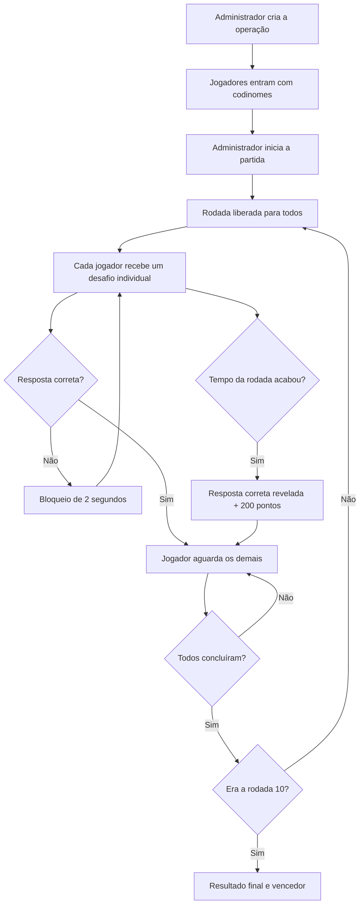
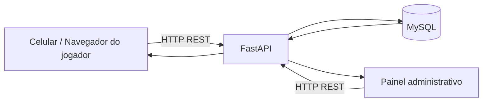

# Escape Code

> Escape room multiplayer com desafios de programação, sincronização entre jogadores e uma interface inspirada em terminais de segurança comprometidos.


---

## Sobre o projeto

**Escape Code** é um jogo multiplayer de perguntas e respostas com temática de cibersegurança. Os participantes entram na partida por um navegador, escolhem um codinome e enfrentam uma sequência de desafios técnicos enquanto um painel central acompanha toda a operação.

O objetivo é recuperar os **10 fragmentos de uma chave mestre** antes que o tempo da missão termine.

O projeto foi desenvolvido como uma aplicação prática para exercitar conceitos de:

- Angular;
- TypeScript;
- Python;
- FastAPI;
- MySQL;
- APIs REST;
- sincronização entre múltiplos clientes;
- controle de estado;
- temporização;
- responsividade;
- tratamento de concorrência;
- experiência de usuário;
- lógica de jogo.

Embora a identidade visual utilize conceitos como _ransomware_, _payload_, _root access_, _encryption_ e _system compromised_, o Escape Code é apenas uma **simulação visual e educacional**. O projeto não executa nenhuma atividade maliciosa no dispositivo do usuário.

---

## Visão geral

A experiência é dividida em três interfaces principais:

### Jogador

Cada participante acessa o sistema pelo navegador, informa um codinome e aguarda o início da operação.

Durante a partida, o jogador recebe:

- uma pergunta por rodada;
- cinco alternativas, de **A a E**;
- cronômetro de **20 segundos**;
- pontuação disponível para aquela tentativa;
- feedback visual ao acertar ou errar;
- fragmentos recuperados da chave;
- tela de sincronização enquanto aguarda os demais jogadores.

### Painel de controle

O painel foi desenvolvido para ficar aberto em uma TV ou projetor durante a partida.

Ele apresenta:

- protocolo atual;
- código da operação;
- tempo restante da missão;
- rodada atual;
- janela de tempo da rodada;
- quantidade total de jogadores conectados;
- progresso global;
- fragmentos recuperados;
- sincronização da rodada;
- **Top 5 jogadores por pontuação**;
- estado dos jogadores;
- efeitos visuais e sonoros;
- botão para iniciar a operação;
- remoção de jogadores cadastrados incorretamente antes do início.

O layout do painel foi ajustado para exibição em telas grandes, incluindo uma TV Full HD de aproximadamente **55 polegadas**, mantendo o conteúdo centralizado e legível.

### Resultado e falha

Se os jogadores completarem a missão, o sistema apresenta a tela de resultado e o vencedor.

Se o tempo total terminar, é iniciado o:

```text
PROTOCOLO ZERO
```

seguido por uma contagem regressiva visual até o encerramento da operação.

---

## Fluxo da partida



---

## Regras do jogo

A partida possui **10 rodadas**.

Cada rodada tem uma janela de **20 segundos** para resposta.

A pontuação depende da tentativa em que o jogador acerta:

| Tentativa       | Pontos |
| --------------- | -----: |
| 1ª              |   1000 |
| 2ª              |    800 |
| 3ª              |    600 |
| 4ª              |    400 |
| 5ª ou posterior |    200 |
| Tempo esgotado  |    200 |

Quando uma alternativa incorreta é escolhida:

1. ela é bloqueada;
2. a interface entra em estado de erro;
3. o jogador fica aproximadamente **2 segundos sem poder interagir**;
4. a tela retorna automaticamente à pergunta;
5. o jogador pode tentar novamente.

Não existe botão manual para avançar de rodada.

---

## Sincronização multiplayer

Um dos principais pontos do projeto é a sincronização entre os participantes.

Quando um jogador termina antes dos outros, ele entra em uma tela de espera:

```text
AGUARDANDO OS DEMAIS CODINOMES
```

A rodada seguinte só é liberada quando **todos os jogadores ativos** concluíram a rodada atual.

Isso evita que um participante avance sozinho e mantém toda a turma trabalhando na mesma rodada global.

---

## Cronômetro sincronizado

Inicialmente, cada navegador atualizava o tempo usando seu próprio `setInterval`, o que podia provocar pequenas diferenças entre:

- painel;
- jogador 1;
- jogador 2;
- demais celulares.

A solução adotada utiliza o **servidor como relógio central**.

A API informa timestamps absolutos como:

```text
servidor_agora_ms
partida_termina_em_ms
rodada_inicia_em_ms
rodada_termina_em_ms
```

O navegador estima a diferença entre seu relógio local e o relógio do servidor considerando o tempo de ida e volta da requisição.

O estado do jogo continua sendo consultado periodicamente, enquanto o cronômetro visual é redesenhado localmente em intervalos menores.

Resultado esperado:

```text
PAINEL       20  19  18  17...
JOGADOR 1    20  19  18  17...
JOGADOR 2    20  19  18  17...
```

Todos seguem a mesma referência temporal.

---

## Perguntas individuais

Os jogadores não precisam receber exatamente a mesma pergunta.

Ao entrar em uma partida, cada participante recebe uma sequência própria de desafios.

A distribuição utilizada possui questões de:

- HTML;
- SCSS/CSS;
- JavaScript;
- TypeScript;
- Angular;
- Python;
- MySQL.

O sistema também tenta evitar que dois jogadores recebam a mesma questão na mesma rodada quando existem alternativas suficientes no banco.

O banco de desafios possui **100 perguntas** para sorteio.

---

## Alternativas embaralhadas

As alternativas de cada questão também são embaralhadas.

Isso evita um padrão previsível como:

```text
A = sempre correta
```

O banco pode continuar armazenando a pergunta em seu formato original:

```text
A = alternativa original A
B = alternativa original B
C = alternativa original C
D = alternativa original D
E = alternativa original E
```

Antes de enviar a questão ao jogador, a API cria um mapa de exibição.

Exemplo:

```text
Tela A -> alternativa original C
Tela B -> alternativa original E
Tela C -> alternativa original A
Tela D -> alternativa original B
Tela E -> alternativa original D
```

Se a correta original for `A`, nesse exemplo a resposta correta visível seria `C`.

### Por que o embaralhamento é determinístico?

A ordem é gerada com base no jogador e na pergunta.

Isso garante que:

- jogadores diferentes possam enxergar ordens diferentes;
- atualizar a página não mude as alternativas no meio da rodada;
- alternativas já bloqueadas continuem corretamente bloqueadas;
- o timeout consiga revelar a letra que realmente estava visível ao jogador.

---

## Proteção contra respostas atrasadas

Existe uma condição especialmente delicada:

```text
faltam 1 ou 2 segundos
        ↓
jogador clica em uma resposta
        ↓
a requisição viaja pela rede
        ↓
o servidor encerra a rodada
```

Sem uma validação adicional, uma resposta da rodada anterior poderia chegar depois do timeout e interferir na rodada seguinte.

Por isso, cada resposta enviada contém:

```json
{
  "jogador_id": 7,
  "rodada": 6,
  "desafio_id": 42,
  "alternativa": "C"
}
```

O backend valida:

- jogador;
- partida;
- rodada atual;
- desafio atual;
- alternativa;
- estado da rodada.

Se a resposta já estiver atrasada, a API rejeita a operação e o frontend busca imediatamente o estado verdadeiro do servidor.

Esse mecanismo também corrigiu um bug em que o efeito de erro podia ficar preso quando uma resposta incorreta acontecia exatamente no final do cronômetro.

---

## Experiência visual

A identidade do Escape Code mistura:

- terminal de segurança;
- central de operações;
- ransomware fictício;
- telemetria;
- HUDs;
- scanners;
- códigos flutuantes;
- glitches;
- alertas;
- rastreamento de nós;
- efeitos de criptografia.

Existem códigos animados:

- no fundo da tela;
- dentro do terminal do jogador;
- dentro do painel;
- em movimentos horizontais;
- em movimentos verticais;
- em velocidades diferentes.

Nos últimos segundos da rodada, elementos verdes passam gradualmente para tons de vermelho para reforçar a sensação de risco.

---

## Áudio e feedback

O painel utiliza `AudioContext` do navegador para gerar efeitos sonoros sem depender obrigatoriamente de arquivos de áudio externos.

Entre os efeitos estão:

- pulsos nos últimos segundos;
- confirmação de conclusão;
- erro de jogador;
- timeout;
- impacto digital;
- ruído filtrado;
- alerta de falha.

Quando alguém responde incorretamente, o painel também recebe um evento visual:

```text
PACOTE CORROMPIDO
CODINOME // RESPOSTA INVALIDADA
```

O console treme por um curto período e retorna automaticamente ao estado normal.

> Alguns navegadores bloqueiam áudio antes da primeira interação do usuário. A autenticação e o botão de início do painel normalmente liberam o `AudioContext`.

---

## Top 5

Durante a partida, o painel exibe apenas os **cinco melhores jogadores**, evitando que uma turma grande deixe a interface visualmente poluída.

A ordenação considera:

1. maior pontuação;
2. maior quantidade de rodadas concluídas;
3. critério interno de desempate para manter a ordem estável.

Mesmo exibindo somente cinco nomes, o sistema continua considerando **todos os participantes** na sincronização da rodada.

Antes da partida, a interface pode mostrar somente os cadastros mais recentes para facilitar a administração e a remoção de nomes inseridos incorretamente.

---

## Codinomes

O codinome precisa ser único apenas dentro da operação atual.

Isso significa que um participante pode utilizar novamente o mesmo nome em uma partida futura.

Exemplo:

```text
Partida 1
RAFA -> 8200 pontos

Partida 2
RAFA -> 0 pontos
```

A pontuação não é transportada para uma nova operação.

---

## Responsividade

A interface foi preparada para diferentes tamanhos de tela.

### Celulares

A entrada e a tela das perguntas usam proteções como:

```css
max-width: 100vw;
min-width: 0;
overflow-x: hidden;
```

Além de grids com:

```css
minmax(0, 1fr)
```

Isso ajuda a impedir:

- rolagem horizontal indesejada;
- alternativas saindo da tela;
- textos longos quebrando o layout;
- cabeçalhos maiores que o viewport.

Também é utilizado `100dvh`, que se adapta melhor à área disponível nos navegadores móveis.

### Painel

O painel possui comportamento específico para:

- TV / Full HD;
- desktop;
- notebook;
- tablet;
- testes em celular.

Em telas grandes, o console fica centralizado com largura controlada para não ocupar toda a TV de ponta a ponta.

---

## Arquitetura



### Frontend

Tecnologias principais:

- Angular;
- TypeScript;
- SCSS;
- HttpClient;
- Angular Router;
- Web Audio API.

Rotas principais:

```text
/           Entrada do jogador
/jogo       Perguntas e partida
/painel     Painel administrativo
/resultado  Resultado final
/falha      Falha / Protocolo Zero
```

### Backend

Tecnologias principais:

- Python;
- FastAPI;
- mysql-connector-python;
- python-dotenv.

Responsabilidades do backend:

- criação de partidas;
- cadastro de jogadores;
- sorteio dos desafios;
- validação das respostas;
- cálculo de pontuação;
- controle das rodadas;
- processamento de timeout;
- sincronização;
- relógio central;
- resultado;
- administração do painel.

### Banco de dados

O MySQL armazena informações como:

```text
partidas
jogadores
desafios
jogador_desafios
tentativas
```

A tabela de desafios possui o banco de perguntas utilizado durante os sorteios.

---

## Estrutura do projeto

```text
escape-code/
├── backend/
│   ├── main.py
│   ├── banco.py
│   ├── modelos.py
│   ├── regras_jogo.py
│   ├── seguranca_admin.py
│   ├── requirements.txt
│   ├── .env
│   └── rotas/
│       ├── __init__.py
│       ├── admin.py
│       ├── jogadores.py
│       ├── painel.py
│       ├── partidas.py
│       ├── respostas.py
│       └── resultados.py
│
└── frontend/
    └── src/
        └── app/
            ├── app.routes.ts
            └── paginas/
                ├── entrada/
                ├── jogo/
                ├── painel/
                ├── resultado/
                └── falha/
```

---

## Configuração

### Pré-requisitos

Para executar o projeto localmente:

- Python;
- Node.js;
- npm;
- Angular CLI;
- MySQL.

---

## Configurando o backend

Entre na pasta:

```bash
cd backend
```

Crie um ambiente virtual:

```bash
python -m venv .venv
```

No Linux/macOS:

```bash
source .venv/bin/activate
```

No Windows PowerShell:

```powershell
.\.venv\Scripts\Activate.ps1
```

Instale as dependências:

```bash
pip install -r requirements.txt
```

Crie o arquivo `.env`.

Exemplo:

```env
DB_HOST=localhost
DB_PORT=3306
DB_USUARIO=root
DB_SENHA=sua_senha
DB_BANCO=escape_code

ADMIN_CHAVE=troque-esta-chave
DURACAO_PARTIDA_SEGUNDOS=180
DURACAO_RODADA_SEGUNDOS=20
```

> Não publique senhas reais ou a chave administrativa no GitHub. Mantenha o `.env` no `.gitignore`.

Inicie a API:

```bash
fastapi dev
```

Por padrão, a documentação interativa do FastAPI fica disponível em:

```text
http://127.0.0.1:8000/docs
```

---

## Configurando o frontend

Entre na pasta:

```bash
cd frontend
```

Instale as dependências:

```bash
npm install
```

Inicie o Angular:

```bash
ng serve
```

A aplicação local ficará disponível normalmente em:

```text
http://localhost:4200
```

---

## Configurando o banco

Crie o banco:

```sql
CREATE DATABASE escape_code;
```

Depois importe o script SQL correspondente ao schema e ao banco de desafios do projeto.

Durante o desenvolvimento foi utilizado um conjunto de **100 perguntas**.

> Scripts de reset usados durante desenvolvimento podem apagar partidas, jogadores e tentativas. Não execute um script de limpeza em um ambiente que contenha dados que você deseja preservar.

---

## Como testar o multiplayer

Uma forma simples é utilizar:

- navegador normal;
- janela anônima;
- outro navegador;
- celular.

Exemplo de teste:

1. abra `/painel`;
2. autentique o painel;
3. crie uma nova operação;
4. abra `/` em dois navegadores;
5. cadastre dois codinomes;
6. inicie a operação pelo painel;
7. confira se as perguntas são individuais;
8. verifique se as alternativas aparecem em posições diferentes;
9. faça um jogador acertar;
10. confirme que ele entra em espera;
11. erre no segundo jogador;
12. confirme o bloqueio de 2 segundos;
13. confira o tremor no painel;
14. termine a rodada;
15. confirme que ambos recebem a próxima rodada;
16. deixe uma pergunta chegar a zero;
17. confirme a resposta automática de timeout;
18. teste uma resposta errada em `1` ou `2` segundos;
19. confirme que a interface não fica presa;
20. finalize a partida e confira o resultado.

---

## Teste de responsividade

No DevTools do navegador, alguns tamanhos úteis:

```text
360 x 800
390 x 844
412 x 915
430 x 932
```

Verifique principalmente:

- ausência de rolagem horizontal;
- leitura da pergunta;
- largura das alternativas;
- cabeçalho;
- cronômetro;
- tela de espera;
- resultado;
- falha.

O teste final deve ser realizado também em um celular real.

---

## Decisões técnicas importantes

### REST em vez de WebSocket

O Escape Code utiliza requisições HTTP periódicas para manter o estado atualizado.

Para o tamanho e o objetivo acadêmico do projeto, essa abordagem reduz complexidade e permite estudar claramente:

- chamadas de API;
- estado do frontend;
- sincronização;
- tratamento de concorrência;
- temporização.

### Servidor como fonte de verdade

Pontuação, rodada, respostas, timeout e estado da partida não dependem apenas do navegador.

O backend é a fonte principal de verdade da operação.

### Embaralhamento estável

As alternativas são embaralhadas sem mudar toda vez que a página é atualizada.

Isso melhora a experiência e impede inconsistências entre:

- alternativa clicada;
- alternativa bloqueada;
- resposta correta;
- timeout.

---

## Principais desafios resolvidos

Durante o desenvolvimento, alguns problemas interessantes precisaram ser tratados:

- sincronização de múltiplos jogadores;
- jogadores terminando em tempos diferentes;
- timeout simultâneo;
- respostas chegando perto do final do cronômetro;
- respostas de uma rodada chegando depois da mudança de rodada;
- diferença visual de tempo entre dispositivos;
- repetição de perguntas;
- padrão previsível da alternativa correta;
- atualização do painel;
- responsividade em celular;
- áudio bloqueado pelo navegador;
- feedback visual sem prejudicar a legibilidade;
- interface adequada para TV.

Esses problemas tornaram o projeto muito mais do que uma simples tela de perguntas e respostas.

---

## O que este projeto demonstra

O Escape Code foi uma oportunidade de colocar em prática conhecimentos de desenvolvimento **full stack** em um projeto interativo.

Entre os conceitos utilizados estão:

```text
Angular
TypeScript
SCSS
Python
FastAPI
MySQL
REST API
Estado assíncrono
Polling
Sincronização
Race conditions
Validação no backend
Responsividade
Web Audio API
UX/UI
Lógica de jogo
```

Para portfólio, o projeto demonstra principalmente a capacidade de transformar uma ideia em uma aplicação completa, passando por:

1. modelagem dos dados;
2. criação da API;
3. regras de negócio;
4. frontend;
5. comunicação cliente-servidor;
6. correção de bugs;
7. refinamento da experiência;
8. testes multiplayer;
9. otimização para diferentes dispositivos.

---

## Próximos passos

Possíveis evoluções:

- publicação em ambiente externo;
- QR Code para entrada rápida dos jogadores;
- testes com uma turma completa;
- painel de histórico de partidas;
- testes automatizados adicionais;
- configuração de produção;
- logs estruturados;
- melhorias de acessibilidade;
- configuração por painel dos tempos da partida;
- banco de perguntas administrável;
- métricas das partidas.

---

## Status

**Em desenvolvimento — versão funcional para testes e apresentação.**

As funcionalidades principais do jogo multiplayer já estão implementadas, e o projeto continua recebendo ajustes de experiência, estabilidade e apresentação.

---

## Aviso

Este projeto utiliza terminologia e elementos visuais associados a ataques cibernéticos apenas como parte da temática do jogo.

O Escape Code não é uma ferramenta de invasão, ransomware ou exploração de sistemas.

---

Se você gostou do projeto, deixe uma ⭐ no repositório.
